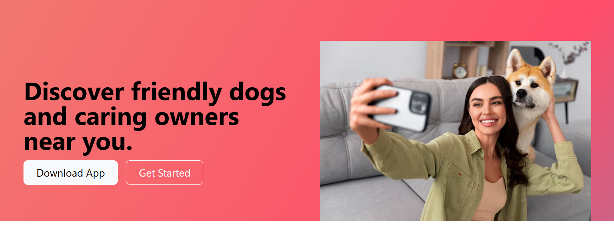

# 🐾 PawConnect

**PawConnect** is a modern, responsive landing page built using **Bootstrap 5**, designed to help dog lovers connect with friendly dogs and caring owners nearby.  
The project focuses on clean UI, responsiveness, and real-world startup-style layout.

---

## 🚀 Live Demo
🔗 https://kaushikshivam-stack.github.io/pawconnect  

---

## 📌 Features

- ✅ Responsive design (mobile, tablet & desktop)
- 🎨 Modern gradient UI
- 🐶 Dog-lover focused landing page
- 💬 Testimonial section
- 💳 Pricing plans layout
- ⚡ Fast loading with Bootstrap 5
- 🧩 Clean and organized folder structure

---

## 🛠️ Tech Stack

- **HTML5**
- **CSS3**
- **Bootstrap 5**
- **Google Fonts**

---
## 📸 Project Screenshots

### Home Page

### Dark Mode

### Light Mode

### Calculator Working

## ⭐ Support

If you like this project:
⭐ Star this repository

Thanks for visiting! 🚀🐾
